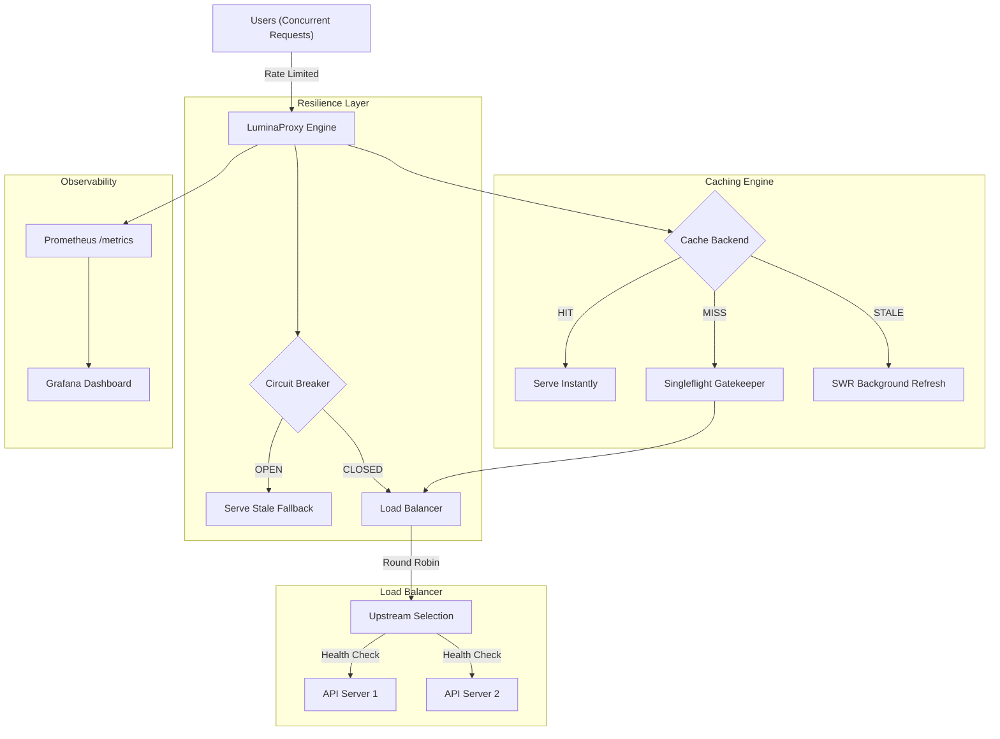

# Go-Lumina Enterprise API Gateway

**Go-Lumina** is a experimental API Gateway and Distributed Caching Proxy written in Golang. It is designed to handle high-traffic environments by providing multi-level resilience, observability, and caching.

## Enterprise Features

- **Round-Robin Load Balancing**: Automatically distributes traffic across multiple upstream servers with built-in **Active Health Checks**.
- **Hybrid Caching (Distributed)**: Seamlessly switch between local **LRU Memory Cache** and **Redis Distributed Cache** for multi-instance scalability.
- **Circuit Breaker (Netflix Hystrix Style)**: Protects your infrastructure by "tripping" the circuit during upstream failures, preventing cascading outages.
- **Stale-While-Revalidate (SWR)**: Serves cached responses using stale data while refreshing the cache in the background.
- **Anti-Cache Stampede (Singleflight)**: Coalesces cache fills within each gateway instance.
- **Deep Observability**: Native **Prometheus** metrics integration and pre-configured **Grafana** dashboards.
- **IP-Based Rate Limiting**: Limits request rates per client IP using a Token Bucket algorithm.
- **DevOps Ready**: Multi-stage Docker images and full `docker-compose` orchestration.

---

## Architecture



---

## Tech Stack

- **Core**: Go 1.26+, `net/http/httputil`
- **Caching**: `github.com/hashicorp/golang-lru/v2`, `github.com/redis/go-redis/v9`
- **Resilience**: Custom Circuit Breaker implementation, `golang.org/x/sync/singleflight`
- **Observability**: `github.com/prometheus/client_golang`
- **Infrastructure**: Docker, Redis, Prometheus, Grafana

---

## Quick Start (Docker Compose)

The easiest way to see Go-Lumina in action is using `docker-compose`. This will spin up the Proxy, Redis, Prometheus, and Grafana.

```bash
# Clone and Run
git clone https://github.com/AmiQT/LuminaProxy.git
cd LuminaProxy
docker-compose up --build
```

### Access Points:
- **Proxy Gateway**: `http://localhost:8080`
- **Prometheus**: `http://localhost:9090`
- **Grafana**: `http://localhost:3000` (Default: `admin/admin`)
- **JSON Metrics**: `http://localhost:8080/lumina-metrics`

---

## Configuration (Environment Variables)

| Variable | Description | Default |
| :--- | :--- | :--- |
| `LUMINA_UPSTREAMS` | Comma-separated upstream URLs | `https://jsonplaceholder.typicode.com` |
| `LUMINA_PORT` | Port the proxy listens on | `8080` |
| `LUMINA_REDIS_URL` | Redis connection string (enables distributed cache) | `""` (Uses LRU) |
| `LUMINA_CACHE_TTL_SECONDS` | Time to live for cache items | `60` |

---

## Observability and Metrics

Go-Lumina exposes high-granularity metrics for SREs:
- `lumina_requests_total`: Total requests processed.
- `lumina_cache_hits_total`: Total successful cache hits.
- `lumina_cache_misses_total`: Total cache misses.
- `lumina_circuit_trips_total`: Number of times the circuit breaker has tripped.

---

## License
MIT License. Created by **AmiQT**.

## Behavior and limits

This project is a learning and portfolio gateway, not a production-readiness guarantee.
Compose starts two equivalent Nginx demo upstreams. The gateway uses Go 1.26.

Only GET responses with status 200 and bodies up to 1 MiB are cached. Requests
with credentials, cookies, ranges, cache directives or conditional validators bypass
cache. Responses with Set-Cookie, Cache-Control, Vary, Content-Encoding or Expires
also bypass cache conservatively. Upstream headers are preserved. Cache keys include
upstream URL and request headers; replicas may therefore maintain separate entries.
Singleflight coordination is per process, including when Redis is enabled.

Use `-ttl` (default 60 seconds, configurable with LUMINA_CACHE_TTL_SECONDS) and
`-stale` (default 30 seconds); require 0 <= stale <= ttl. Requests have a 30-second
budget, upstream response headers a 10-second timeout, and cache buffering is capped
at 1 MiB before switching to streaming. The circuit breaker is shared across upstreams
and permits one recovery probe. Rate limiting uses the direct peer IP, with a bounded
10,000-entry map and five-minute idle eviction when capacity is reached.

Metrics are available on the gateway port; restrict access at your network boundary.
Redis is internal to the Compose network. Grafana's demo credentials should be changed
before exposing the demo outside your local environment.

## Validation

```sh
go test ./...
go test -race ./...
go vet ./...
go build ./...
```

The race check requires a supported C toolchain. No latency or image-size benchmark
is claimed by this repository.

Set `LUMINA_TEST_REDIS_URL` to a disposable Redis instance to include the Redis
integration test. CI supplies Redis and runs the complete suite with the race detector.
